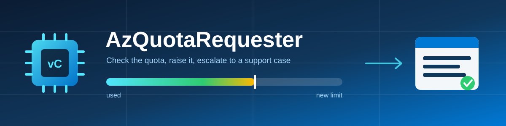

# AzQuotaRequester

PowerShell tool for Azure compute vCPU quota increases: it checks the quota you already have, requests more through the `Microsoft.Quota` API, and escalates to an Azure support case only when the automatic request is refused.

> **Just want the process, not the tool?** [docs/quota-automation-manual.md](docs/quota-automation-manual.md) documents the same steps as standalone REST/PowerShell snippets you can drop into your own code.
>
> **Want it in chat instead?** [mcp/README.md](mcp/README.md) runs the same logic as a local MCP server, so GitHub Copilot CLI or VS Code can check and request quota as *you*, using your existing Azure sign-in.

---

## What it does

1. **Picks the Azure context** — keep the current one, choose another subscription (also across tenants), or sign in as a different user or tenant.
2. **Checks the resource providers** — `Microsoft.Compute`, `Microsoft.Quota`, `Microsoft.Support`, and registers them on request.
3. **Suggests the right SKU** — shows which families already carry usage, then offers the requested size in newer generations that the region actually provides, each with its quota and zone state.
4. **Verifies the SKU is usable** — separates "no quota" from "restricted for this subscription", "blocked in every zone" and "not offered in this region"; only the first can be fixed by a quota request.
5. **Reads the current quota** — limit, usage and free capacity for the SKU family *and* for Total Regional vCPUs.
6. **Requests the increase** — submits through `Microsoft.Quota` and polls it to a final state.
7. **Raises a support case** — when the automatic request is refused, files a quota case from your template, stepping the severity down if the support plan does not cover it.

### SKU availability states

| Status | Meaning | Way forward |
|---|---|---|
| `Available` | Usable, quota bucket has a limit. | Quota request. |
| `ZeroQuota` | Bucket exists, limit is 0. | Quota request. |
| `ZoneRestricted` | Blocked in some zones, usable in others. | Quota request; pin the deployment to a usable zone. |
| `NoQuotaBucket` | Offered and unrestricted, but the region exposes no bucket for the family. | Support case. |
| `RestrictedForSubscription` | Not enabled for this subscription, or blocked in every zone. | Support case. |
| `RestrictedBySubscriptionOffer` | The subscription offer excludes the SKU. | Support case, or a different offer. |
| `NotOfferedInRegion` | Azure does not list the SKU there at all. | Nothing to request — choose another region. |

---

## Requirements

| Item | Requirement |
|---|---|
| PowerShell | 5.1 or 7 |
| Module | `Az.Accounts` only — everything else goes through `Invoke-AzRestMethod` |
| Read the quota | **Reader** on the subscription |
| Request the quota | **Contributor** or **Quota Request Operator** |
| Raise the support case | **Support Request Contributor** *and* a Professional Direct, Premier or Unified support plan |

```powershell
Install-Module Az.Accounts -Scope CurrentUser
Connect-AzAccount
```

> The quota request works on any support plan. Only the support case needs a high-tier plan — see [Support plan requirement](#support-plan-requirement).

---

## Usage

### 1. Create your support case template (once)

```powershell
git clone https://github.com/chrochma/AzQuotaRequester.git
cd .\AzQuotaRequester
.\New-AqrTicketTemplate.ps1
```

Twelve steps: contact name, e-mail, additional e-mails, contact method, phone, country, time zone, support language, severity, response options, case text, support plan. The result is written to `%APPDATA%\AzQuotaRequester\support-ticket-template.json`, outside the repo, so a `git pull` cannot overwrite it.

| Parameter | Purpose |
|---|---|
| `-Path <file>` | Write a different template, e.g. a second profile for production. |
| `-Force` | Overwrite without asking (an existing file is still backed up). |

### 2. Request the quota

**Interactive** — asks for context, region, SKU and target vCores:

```powershell
.\Start-AzQuotaRequest.ps1
```

**Unattended** — for a pipeline:

```powershell
.\Start-AzQuotaRequest.ps1 -SubscriptionId <guid> -Location westeurope -VmSku Standard_D4s_v5 -TargetVCores 64 -RegisterProviders -NonInteractive
```

**Size from instance count** instead of absolute vCores:

```powershell
.\Start-AzQuotaRequest.ps1 -Location northeurope -VmSku Standard_NC24ads_A100_v4 -InstanceCount 4
```

**Skip the automatic attempt** and go straight to a support case:

```powershell
.\Start-AzQuotaRequest.ps1 -Location westeurope -VmSku Standard_D4s_v5 -TargetVCores 64 -ForceSupportTicket
```

#### Parameters

| Parameter | Purpose |
|---|---|
| `-SubscriptionId <guid>` | Target subscription. Skips the context question. |
| `-TenantId <guid\|domain>` | Tenant to work in; switches context or signs in when it differs. |
| `-Reauthenticate` | Force a fresh `Connect-AzAccount`. |
| `-UseCurrentContext` | Use the current Az context as-is, without asking. |
| `-Location <region>` | Region name or display name (`westeurope` or `"West Europe"`). |
| `-VmSku <name>` | VM size whose quota family is raised. Accepts `Standard_D4ads_v7`, `D4ads_v7` or `Standard D4ads v7`. |
| `-TargetVCores <n>` | New **absolute** vCPU limit for the family (not an increment). |
| `-InstanceCount <n>` | Alternative to `-TargetVCores`: usage + instances × vCPUs per instance. |
| `-Spot` | Target the regional Spot pool (`lowPriorityCores`) instead of the family. |
| `-SkipRegionalTotal` | Do not raise `Total Regional vCPUs` alongside the family. |
| `-RegisterProviders` | Register missing resource providers instead of only reporting them. |
| `-TemplatePath <file>` | Support case template. Defaults to the personal template under `%APPDATA%`. |
| `-Severity <level>` | Override the template severity. |
| `-NoSupportTicket` | Report the automatic result, never open a case. |
| `-ForceSupportTicket` | Skip the automatic attempt, go straight to the case. |
| `-NonInteractive` | Fail instead of prompting for missing values. |
| `-TimeoutSeconds <n>` | Polling timeout for the automatic request (default 600). |
| `-WhatIf` | Dry run. |

### 3. Run the self-test

```powershell
.\tests\Test-AzQuotaRequester.ps1                 # offline: parsing, exports, template validation
.\tests\Test-AzQuotaRequester.ps1 -Online         # adds read-only Azure checks
.\tests\Test-AzQuotaRequester.ps1 -Online -Location westeurope -VmSku Standard_D4s_v5
```

The online run never writes anything — the support case is rendered with `-WhatIf` and only inspected.

### 4. Optional: use it from Copilot instead

```powershell
copilot mcp add azquota -- pwsh -NoProfile -File C:\path\to\AzQuotaRequester\mcp\Start-AqrMcpServer.ps1
```

Then ask in plain language:

> *"Do I have room for eight more D4ads_v7 in Italy North?"*
> *"Raise the Dadsv7 quota there to 64."*

The server runs locally and uses your existing `Connect-AzAccount` session, so
quota reads and requests happen under your own RBAC. Results carry a
**recommendation**, not just numbers: quota headroom, subscription
restrictions, zone coverage and newer generations are assessed together, so a
healthy limit on a restricted SKU never reads as "you're fine". Five read-only
tools and one that requests an increase; it never files a support case. Setup,
the verdicts and the safety rules are in **[mcp/README.md](mcp/README.md)**.

This works with **GitHub Copilot CLI and VS Code**. Microsoft 365 Copilot and
Copilot Studio cannot use it — they only accept a remote HTTPS MCP server and
cannot reach your machine. See [mcp/README.md](mcp/README.md#why-this-cannot-work-with-microsoft-365-copilot).

---

## How it behaves

### SKU suggestions

Before asking for a target, the tool shows which families already carry usage, each with an example SKU name:

```text
  Families already in use in <region> :
    Standard Dadsv7 Family vCPUs       16/20 vCPUs   e.g. Standard_D128ads_v7
  Paste a SKU name, or the family name above - both are accepted.
```

The prompt accepts anything the tool prints — a SKU name, a short form, a quota family name, or a family display name:

| Pasted | Result |
|---|---|
| `Standard_D4ads_v7` | That SKU |
| `D4ads_v7`, `Standard D4ads v7`, `d4ads-v7` | That SKU (casing and separators are ignored) |
| `StandardDadsv7Family` | The family — pick a size from its list |
| `Standard Dadsv7 Family vCPUs` | The family — pick a size from its list |
| `NC24` | One hit — taken directly, and reported |
| `D4ads` | Several hits — pick from the menu |
| `zzz` | No hit — the prompt asks again |

Matching runs in order of confidence, so an exact SKU name always wins over a family that contains it. Menus are sorted by size and generation (`D2 → D4 → D8 → D16 … D128`), not alphabetically.

The same tolerance applies to `-VmSku` on the command line.

After a size is chosen, the same size is offered in newer generations that the region really provides:

```text
  SKU                           vCPU STATUS           LIMIT ZONES      NOTE
> Standard_D16ads_v5              16 Restricted          20 -          current selection; AZ 1,2,3 restricted for this subscription; NotAvailableForSubscription
  Standard_D16ads_v6              16 Restricted          20 -          newer generation; AZ 1,2,3 restricted for this subscription; NotAvailableForSubscription
  Standard_D16ads_v7              16 Available           20 2,3        newer generation; AZ 1 not available; only 2 of 3 AZs
```

`>` marks what you selected, `*` marks a newer generation that is usable **across every AZ**. Only SKUs the region offers appear, each annotated with its quota limit and usable zones.

Rows are colour-coded by how usable they are, in tones deliberately lighter than the `[ok]`/`[warn]`/`[fail]` result messages so a table row is never mistaken for an outcome. Colour carries **one** meaning — usability — and your current selection keeps that meaning, only in a stronger tone:

| Coverage | Other rows | Your selection |
|---|---|---|
| Usable in **every** AZ of the region | Light green | Green |
| Usable, but only in **some** AZs | Light yellow | Orange |
| Restricted, or not available at all | Dark red | Red |

So a healthy selection reads as healthy, and only a real problem shows up red. The legend is printed under every table. Colour is emitted as 256-colour ANSI where the console supports it, falls back to the classic console colours on older hosts, and is dropped entirely when `NO_COLOR` is set.

### Availability zones

Zone coverage is compared against what the region actually provides, and the two reasons a zone cannot be used are kept apart:

| Wording | Meaning |
|---|---|
| `AZ 1 not available` | The SKU is simply not offered in that zone. |
| `AZ 1,2,3 restricted for this subscription` | The zone is offered but blocked for this subscription. |

A SKU can be `Available` and still not cover the whole region. That case is **light yellow**, not green, and never marked as recommended:

```text
* Standard_D4s_v6                  4 Available           20 1,2,3      NEWER GENERATION - recommended
  Standard_D16ads_v7              16 Available           20 2,3        newer generation; AZ 1 not available; only 2 of 3 AZs
```

The summary line reflects it too:

```text
  [warn] A newer generation is usable but not in every AZ: Standard_D16ads_v7 (AZ 2,3). Pin the deployment to a usable zone.
```

### Entering a family skips the size question

Quota is granted **per family in vCPUs**, so when the input resolves to a family the individual size is irrelevant and is not asked for. Each generation is its own quota bucket, so the generations are offered at family level instead:

```text
  'dadsv5' is the quota family 'standardDADSv5Family' (8 sizes). Quota is granted per family, so no size is needed.

  QUOTA FAMILY                 SIZES STATUS           LIMIT ZONES      NOTE
> standardDADSv5Family             8 Restricted          20 -          current selection; e.g. Standard_D2ads_v5; AZ 1,2,3 restricted for this subscription
  standardDadv6Family              8 Restricted          20 -          newer generation; e.g. Standard_D2ads_v6; AZ 1,2,3 restricted for this subscription
  StandardDadsv7Family             8 Available           20 2,3        newer generation; e.g. Standard_D2ads_v7; AZ 1 not available; only 2 of 3 AZs
```

Azure names the quota family inconsistently across generations of the **same** SKU line, so each row also names one of its member SKUs. Without that, the v6 row reads like a different line entirely:

| Quota family | Contains |
|---|---|
| `standardDADSv5Family` | `Standard_D*ads_v5` |
| `standardDadv6Family` | `Standard_D*ads_v6` — note the missing `s` in the **family** name |
| `StandardDadsv7Family` | `Standard_D*ads_v7` |

There is no separate `Dadsv6` family and no non-premium `Standard_D*ad_v6` SKU — `standardDadv6Family` **is** the v6 generation of the `ads` line. Because of this, generations are derived from the **SKU names** in each family, never from the family name.

In family mode the tool also skips the instance-count question — without a single size, an instance count means nothing — and asks directly for the target vCPU limit. Entering a **specific size** keeps the current behaviour, including the instance-count option.

### Zonal restrictions

Zone restrictions are read per SKU and reported separately from a full block:

- Some zones unusable → `ZoneRestricted` or a light yellow `Available`; quota can still be requested, deploy into a usable zone.
- Every zone blocked → `RestrictedForSubscription`; a quota request cannot help, this needs support.

### Unusable SKUs do not end the run

When a SKU cannot be used the tool explains why and offers a choice instead of aborting:

```text
  How do you want to continue?
      1) Choose a different VM SKU
      2) Continue anyway and raise a support request for this SKU
      3) Abort
```

Option 2 appears only when a support case can actually help — never for `NotOfferedInRegion`. It skips the pointless `Microsoft.Quota` call for that family only; other buckets such as `Total Regional vCPUs` are still requested normally.

### Results are verified, never assumed

A quota request that Azure reports as `Succeeded` is **re-read** before it is announced. The tool reports the limit that is actually in place, not the one that was asked for:

| Outcome | Meaning |
|---|---|
| `Succeeded` | The limit was re-read and is at or above the target. |
| `Partial` | Azure reported success but the limit is below the target — escalates to support. |
| `Failed` | The request was refused. |
| `Unverified` | Azure reported success but the quota could not be read back — treated as *not* successful. |

Each bucket is then listed separately, so a success on `Total Regional vCPUs` cannot be mistaken for the SKU family you actually asked about:

```text
  QUOTA                      RESULT         BEFORE      NOW
  StandardDadsv7Family       Failed             20        -
  cores                      Succeeded          40       48

  [fail] 1 of 2 quota increase(s) did NOT succeed: StandardDadsv7Family.
```

### Escalation to a support case

The automatic request is treated as failed, and a case is raised, when:

- the `PUT` to `Microsoft.Quota` returns 4xx/5xx, or
- the request ends in `Failed` / `Invalid` / `Canceled` — typically `ContactSupport` or `QuotaNotAvailableForResource`, or
- it does not reach a final state within `-TimeoutSeconds`.

### Case creation is asynchronous

`PUT .../supportTickets/{name}` answers **HTTP 202 with an empty body** — accepted, not created. The tool polls the `Azure-AsyncOperation` endpoint and only reports success once it reaches `Succeeded`, then re-reads the case for its id and status. Anything that only checks the PUT status code will report a case that does not exist.

### Support plan requirement

Per the [Support REST API prerequisites](https://learn.microsoft.com/rest/api/support/), creating a support case needs a **Professional Direct, Premier or Unified** plan. On Free, Basic, Developer or Standard the call fails asynchronously:

```text
  [fail] Support request not created (HTTP 202): InvalidSupportPlan: Your support plan type is Free.
```

This is an API-level gate — REST, `Az.Support` and `az support` all hit the same endpoint. The **quota request itself is unaffected and works on any plan**.

Azure exposes no API to read the support plan, so this is only known after an attempt. The result is remembered per subscription in `%APPDATA%\AzQuotaRequester\support-api-state.json`, and from then on the tool does not offer a case it cannot create — it prints the portal route and the documentation instead:

```text
  [warn] This subscription cannot create support cases through the API (the support plan does not include it).
  A Professional Direct, Premier or Unified plan is required for the Support API.

  Raise the quota request in the Azure portal instead - quota requests are free of charge on any support plan:
    1. Azure portal  ->  Quotas  ->  My quotas
    2. Filter by provider 'Compute', region '<region>'
    3. Select '<quota>'
    4. Request a new limit of <n>

  Documentation: https://learn.microsoft.com/azure/quotas/quickstart-increase-quota-portal
  Support API prerequisites: https://learn.microsoft.com/rest/api/support/
  Direct link:   https://portal.azure.com/#view/Microsoft_Azure_Capacity/QuotaMenuBlade/~/myQuotas
```

---

## Support case template

### Where it lives

The personal template is deliberately **not** stored in the repository — a `git pull` would overwrite it. Resolution order:

1. `-TemplatePath` / `-Path`
2. `$env:AQR_TEMPLATE_PATH`
3. `%APPDATA%\AzQuotaRequester\support-ticket-template.json` (default)
4. `config\support-ticket-template.json` next to the tool, if you keep one (git-ignored)
5. `config\support-ticket-template.example.json` — the shipped starting point

The repo ships only the **example**. It carries placeholder contact data and is rejected when a real case is raised, so a case can never go out as `Change Me <change.me@example.com>`.

### Placeholders

Replaced at runtime:

`{SubscriptionId}` `{SubscriptionName}` `{Location}` `{VmSku}` `{QuotaName}` `{QuotaDisplayName}` `{CurrentLimit}` `{CurrentUsage}` `{TargetLimit}` `{AdditionalVCores}` `{Timestamp}` `{AutoRequestResult}`

### Field rules

Enforced by the Azure Support API and validated before sending:

| Field | Rule |
|---|---|
| `severity` | `minimal`, `moderate`, `critical`, `highestcriticalimpact`. Quota cases are normally `minimal`. |
| `require24x7Response` | Ignored on severity `minimal`; the builder does not ask for it there. |
| `preferredContactMethod` | `email` or `phone`. `phone` requires `phoneNumber`. |
| `country` | 3-letter ISO 3166 code, e.g. `DEU`. |
| `preferredTimeZone` | Windows time zone id, e.g. `W. Europe Standard Time`. |
| `preferredSupportLanguage` | Locale, e.g. `en-us`. |
| `advancedDiagnosticConsent` | `Yes` or `No`. |
| `phoneNumber`, `additionalEmailAddresses` | Optional. Left empty they are **omitted** — the API rejects empty strings and empty arrays. |
| `quotaChangeRequestSubType` | Leave empty for Compute; it only applies to Batch and SQL MI. |

---

## Notes

- `-TargetVCores` is an absolute limit, not a delta.
- Spot capacity lives in the regional `lowPriorityCores` pool — use `-Spot`.
- Total Regional vCPUs is raised alongside the family, because a family increase alone does not unblock a deployment.
- Support case regions must be TitleCase (`WestEurope`); the tool derives that from the region display name.
- Quota limits are read from the compute usages API, which lists the buckets a region actually has, so a family whose name differs in casing from the SKU `family` property still resolves.

## References

- [Microsoft.Quota REST API](https://learn.microsoft.com/rest/api/quota/)
- [Increase regional vCPU quotas](https://learn.microsoft.com/azure/quotas/regional-quota-requests)
- [Support REST API prerequisites](https://learn.microsoft.com/rest/api/support/)
- [Create a support ticket (REST)](https://learn.microsoft.com/rest/api/support/support-tickets/create)
